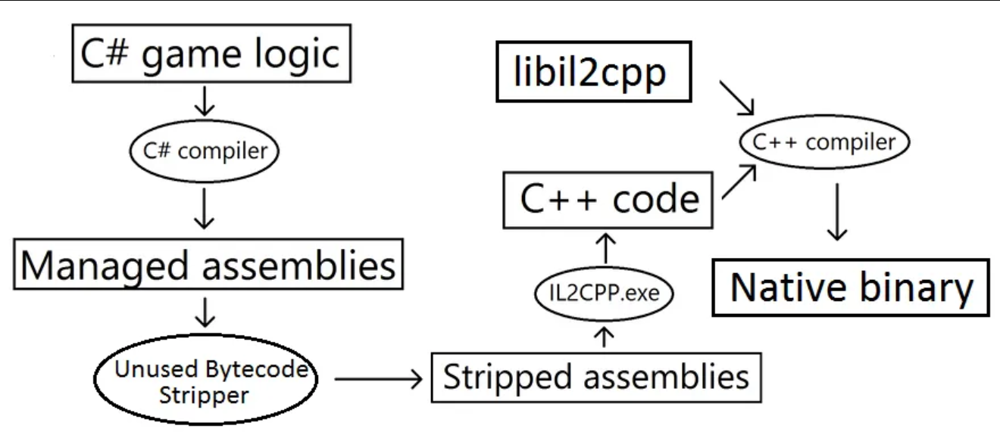
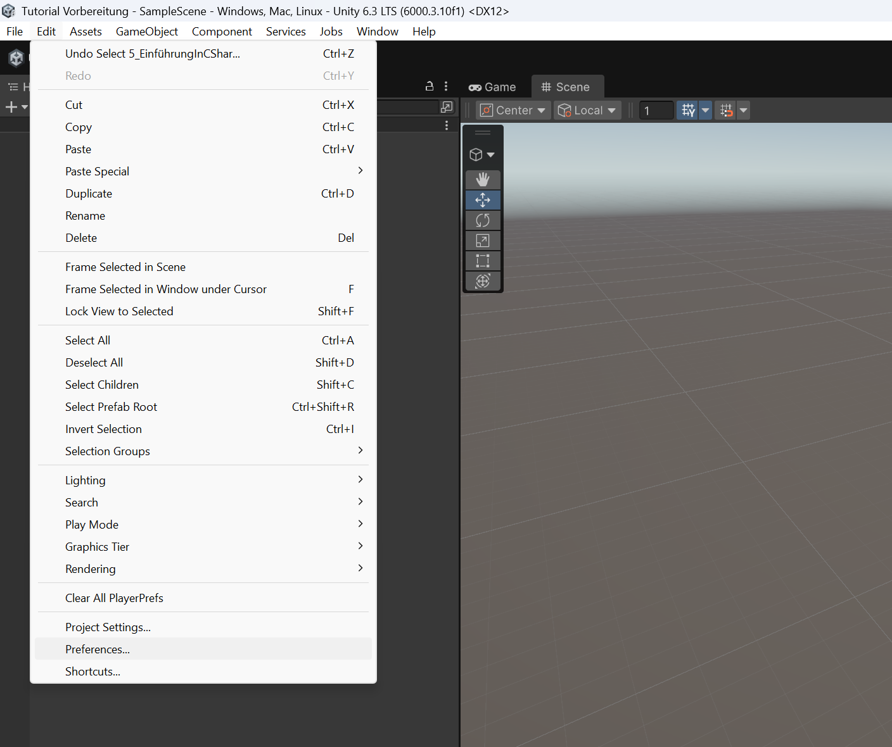
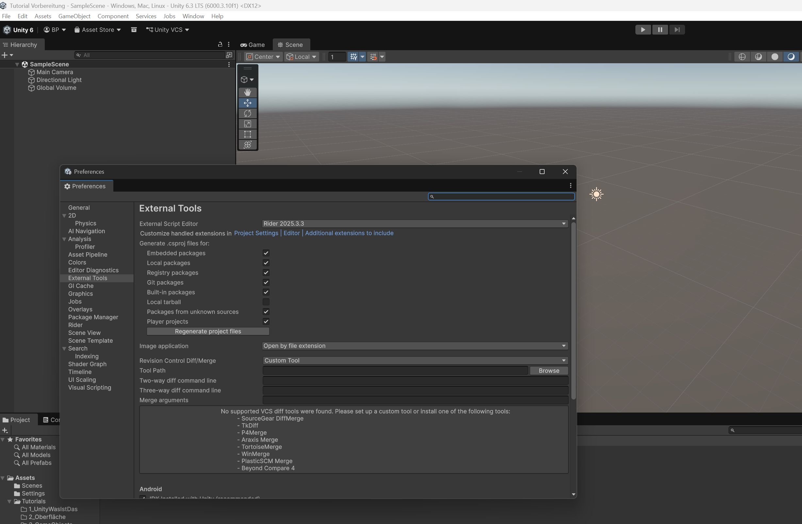

# Rider vs Visual Studio
## Was ist eine IDE?
- Eine IDE ist eine Entwicklungsumgebung für Programmier Code. Sie ist nicht zwingend notwendig und man könnte auch 
im Windows Editor oder auf einem Stück Papier seinen Code schreiben, aber ob das wirklich eine sinnvolle Idee ist?

## Welchen Vorteil haben IDEs gegenüber dem Editor oder einem Stück Papier?
- Dein Code wird automatisch überprüft, auf seine Richtigkeit. Bei besseren IDEs wird er sogar auf seine Sinnhaftigkeit,
und auch auf deine Rechtschreibung und Grammatik überprüft.
### Richtigkeit:
- Es wird überprüft, ob dein Code "Syntaktisch" richtig ist. Das bedeutet, dass es Programmcode ist, der auch in MaschinenCode 
übersetzt werden kann.
```csharp
    // Das würde die IDE als falsch kennzeichenen, da hinten ein ; fehlt
    int test = 0
    // So wäre es richtig und die IDE wird dir auch vorschlagen genau diese ; zu setzen
    int test = 0;
```
### Sinnhaftigkeit:
- Es wird überprüft, ob euer Code "Semantisch" richtig ist. Das bedeutet, ob euer Code zumindest grundlegend Sinn ergibt. 
```csharp
 /*
  * Hier würde dir die IDE sagen, dass der Code den du geschrieben hast, sinnlos ist, da die Variable "test"
  * immer wahr ist und somit immer nur der eine Teil des Programmblocks ausgeführt wird. 
  */ 
bool test = true;
if(test)
{
    // Mach etwas
} else {
    // Mach was anderes
}
```
### Rechtschreibung und Grammatik
- Ja ich weiß nicht, was ich dazu sagen soll. Ich bin allgemein schlecht in Rechtschreibung und Grammatik, also sind IDEs
dafür fantastisch :D (Schrieb er, während die IDE ihn dabei korrigierte ...)

## Kurzer Exkurs "Programm Code"
- Wir sollten uns kurz anschauen, was genau ist Programmieren eigentlich. Viele von euch wurden grade einfach so in das 
Thema gehauen, ohne das eigentlich genau zu wissen. 
- Programmiert wird für Unity in C# ("C-Sharp" ausgesprochen, für alle Deutschen, die absolut kein Englisch können 
"Zi-Scharp" ausgesprochen, also so ungefähr).
- Ja es gab auch mal andere Wege in Unity zu programmieren, aber wer die nutzt, scheint ganz andere Probleme im Kopf zu haben.
  (Dies ist eine persönliche Meinung und muss nicht Ihrer eigenen entsprechen. Sollten Sie mit dieser Meinung dennoch Probleme haben,
wenden Sie sich bitte an Ihren Arzt oder Apotheker.)
- Wenn wir C# programmieren, dann versteht der Computer nicht sofort, wie genau er mit dieser riesen Ansammlung an Zeichen
umzugehen hat. Für den sind das einfach nur irgendwelche Zeichen, die sich jemand verrücktes ausgedacht hat.
- Also muss irgendetwas diese Zeichen in eine Sprache übersetzen, die der Computer auch verstehen kann.
- Im Falle von C# ist das der Compiler. Für alle die des englischen mächtig sind und sich etwas zu sehr dafür interessieren
das sieht so aus:



- Für den Anfang ist für euch nur wichtig. Euer C# Code wird vom Compiler für alle Plattformen, die Unity anbietet übersetzt.
So können alle möglichen Plattformen, für die ihr eure Spiele baut, auch in den Genuss kommen eure Spiele zu spielen.
- Dennoch gibt es Regeln, die man beim Schreiben von Code einhalten muss, sonst kann der Compiler leider nichts mit 
eurem Code anfangen. Diese Regeln sind eine Sprache (C#) die immer korrekt ausgeschrieben sein muss. Das ist die Prüfung nach
Richtigkeit ("Syntaktik"), die die IDE für uns durchführt. Sie gibt uns direkt bescheid, wenn der Compiler unseren Code
nicht verstehen kann.

## Visual Studio
- Kommen wir jetzt zum eigentlichen Titel des Tutorials Rider vs. Visual Studio.
- Visual Studio ist von Microsoft selbst und dazu geschaffen für Windows programme zu entwickeln.
- Es war lange Zeit der sinnvollste Weg in Unity zu programmieren, auch ich habe sehr lange immer mit Visual Studio gearbeitet.
- Doch es gab immer ein paar Probleme mit Visual Studio. Scripte wurden manchmal nicht richtig erkannt und es gab lange
Ladezeiten.

## Rider
- Doch nach einiger Zeit kam Rider hervor (Ich selbst habe erst vor 1-2 Monaten überhaupt davon erfahren, vorher hatte
ich es auch nicht auf dem Schirm.)
- Von den Machern der Programmiersprache Kotlin und der sehr beliebten Java IDE, Intellij wurde dieser Editor entwickelt.
- Rider ist eigentlich einfach nur der kleine Bruder von Intellij, bloß statt den Programmiersprachen Java und Kotlin, 
kann man mit Rider C# programmieren.
- Rider hat geringe Ladezeiten, keine Fehler beim Erkennen der Scripte und viele Annehmlichkeiten, die es sonst nur in 
Intellij zu finden gibt. 
- KI-basiertes Code Completion. Die KI schlägt dir während du deinen Code schreibst automatisch den rest der Zeile vor. 
- Automatisches Speichern deines Codes (im Gegensatz zu Visual Studio muss man nicht dauernd seinen Code speichern)
- Möglichkeit zum Nutzen von Junie (kostet allerdings Geld). Junie ist ein Chatbot, der Zugriff auf deinen Code hat und
du kannst selbst entscheiden, welches LLM (ChatGPT, Gemeni, Claude) du verwenden willst. So kann man noch effizienter 
programmieren, allerdings ist dieses Feature nichts für Anfänger.

## Fazit
- Ihr hört es eigentlich schon anhand meiner Präsentation, dass ich eindeutig eine IDE bevorzuge. Nutzt einfach Rider und
fertig. Es gibt meiner Meinung keinen vernünftigen Grund mehr Visual Studio zu verwenden.

## Wie komme ich an Visual Studio oder Rider ran?
**Visual Studio:** https://visualstudio.microsoft.com/de/ könnt ihr hier Downloaden

**Rider:** https://www.jetbrains.com/de-de/rider/ könnt ihr hier Downloaden

Nutzt einfach die "Non-Commercial Use" so müsst ihr nichts für die IDE zahlen. 

## Wie verbinde ich Visual Studio oder Rider mit Unity?
- Wenn ihr eine der beiden IDEs installiert habt, könnt ihr in Unity in das Menü "Edit/Preferences ..." gehen.



- Dort findet ihr den Punkt "External Tools"



- Im obersten Feld steht "External Script Editor" dort sollte die von euch installierte IDE im Dropdownmenü auswählbar sein.
- Ihr müsst sie nur anklicken und dann die Preferences wieder schließen. Anschließend nutzt Unity für all eure Projekte
die von euch gewählte IDE.